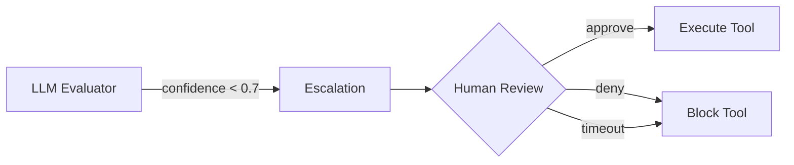

# Enforcement Tiers

MCP Guardian evaluates every tool call through a three-tier pipeline. Each tier is progressively more expensive but more nuanced.

## Tier 1: Fast Check

**Cost:** Zero. No LLM call, no network request.
**Latency:** <1ms.
**Method:** `fast_check` in audit log.

Deterministic rules based on the policy definition:

| Check | Condition | Verdict |
|-------|-----------|---------|
| Forbidden tool | Tool name matches any `forbidden_tools` entry | **Block** |
| Not in whitelist | `allowed_tools` is set and tool doesn't match any entry | **Block** |
| Invalid transition | `allowed_transitions` forbids this sequence | **Block** |
| Pass | None of the above | → Proceed to Tier 2 |

Both `allowed_tools` and `forbidden_tools` support **fnmatch-style glob patterns** (`*`, `?`, `[seq]`) in addition to exact tool names. See [Policies → Wildcard / Glob Patterns](../configuration/policies.md#wildcard--glob-patterns) for details.

Fast-check handles the majority of enforcement decisions in practice. If your policy has well-defined `forbidden_tools` lists, most malicious calls never reach the LLM.

### Examples

```
Policy: forbidden_tools = [write_file, execute_command]

Agent proposes: write_file(path="/etc/passwd", content="...")
→ fast_check: Tool 'write_file' is forbidden → BLOCK (0ms)
```

With glob patterns:

```
Policy: forbidden_tools = [write_*, execute_*]

Agent proposes: write_pdf(path="/tmp/out.pdf", content="...")
→ fast_check: Tool 'write_pdf' matches 'write_*' → BLOCK (0ms)
```

## Tier 2: LLM Intent Evaluation

**Cost:** One LLM API call per evaluation.
**Latency:** 1-5 seconds typically.
**Method:** `llm_intent` in audit log.

When fast-check can't decide (tool is not explicitly forbidden or allowed), the guardian sends the full context to an LLM evaluator:

- The policy's `expected_workflow` and `constraints`
- The proposed tool name and arguments
- The sequence of prior tool calls
- The step number in the workflow

The LLM returns a structured verdict:

```json
{
  "verdict": "allow",
  "confidence": 0.95,
  "reason": "Reading a file is consistent with the expected workflow",
  "risk_indicators": []
}
```

### Decision Logic

| Condition | Verdict |
|-----------|---------|
| Confidence ≥ threshold AND aligned with workflow | **Allow** |
| Confidence ≥ threshold AND misaligned | **Block** |
| Confidence < `escalation_threshold` | **Escalate** |

The default `escalation_threshold` is 0.7. You can tune this per policy.

### What the LLM Sees

The guardian constructs a prompt with:

```
## Intent Policy: read-only-filesystem
**Expected Workflow:** Read local files and list directory contents...
**Forbidden Tools:** write_file, execute_command
**Constraints:**
  - No file modifications
  - No shell commands

## Proposed Tool Call
Tool: read_file
Arguments: {"path": "/home/user/document.txt"}
Step: 2 of workflow
Prior tools: [list_directory]

Evaluate: Does this tool call align with the declared intent?
```

## Tier 3: Escalation

**Cost:** Depends on your escalation handler.
**Latency:** Depends on human response time.
**Method:** `escalate` in audit log.

When the LLM evaluator is uncertain (confidence below threshold), the tool call is flagged for human review. In the demo, this appears as a warning in the output. In production, you can hook this into:

- A Slack notification
- An approval queue
- A blocking prompt in the UI
- An automatic deny with logging

### Escalation Flow



## Audit Trail

Every evaluation is logged with:

| Field | Description |
|-------|-------------|
| `verdict` | `allow`, `block`, or `escalate` |
| `tool_name` | The proposed tool |
| `method` | `fast_check` or `llm_intent` |
| `confidence` | 0.0-1.0 (1.0 for fast-check) |
| `reason` | Human-readable explanation |
| `elapsed_ms` | Evaluation time in milliseconds |
| `phase` | `pre` (before execution) |
| `risk_indicators` | Any risk factors identified by the LLM |

Example audit output:

```
Guardian audit trail (3 evaluations):
  ✓ [pre] list_directory → ALLOW (conf=1.00, method=llm_intent, 3058ms)
  ✓ [pre] read_file → ALLOW (conf=0.95, method=llm_intent, 2159ms)
  ✗ [pre] start_process → BLOCK (conf=1.00, method=fast_check, 0ms)
    Reason: Tool 'start_process' is explicitly forbidden
```
