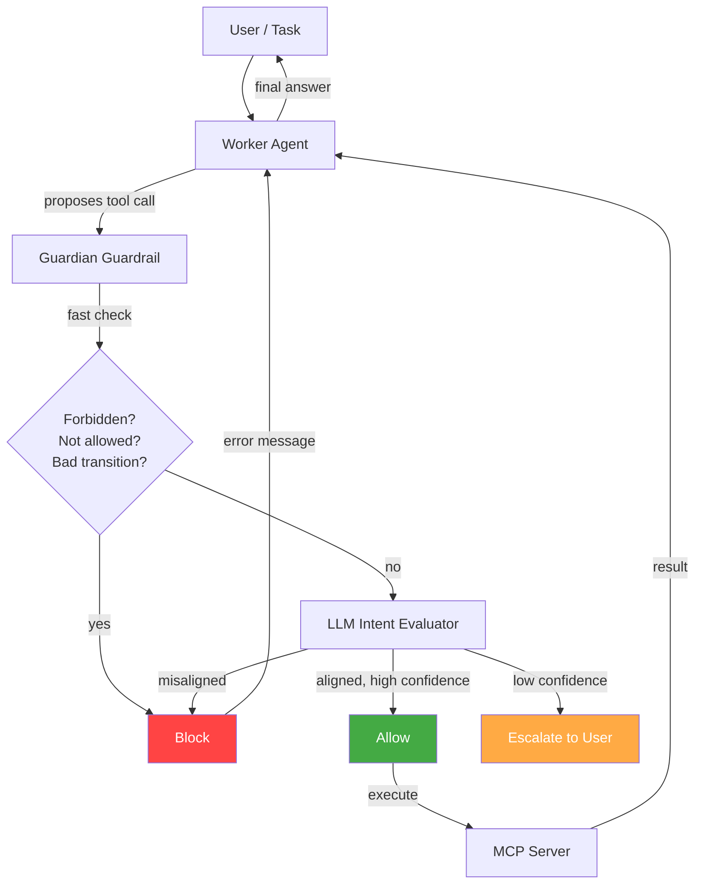

# Architecture Overview

MCP Guardian sits between the worker agent and the MCP servers, intercepting every tool call before it reaches the server.

## System Diagram



## Components

### IntentPolicy

Defines what the agent is *supposed* to do. Contains tool whitelists/blacklists, transition graphs, natural language workflow descriptions, and constraints. Loaded from YAML or JSON files, or defined inline in code.

### GuardianToolGuardrail

The enforcement engine. Implements the OpenAI Agents SDK `ToolInputGuardrail` interface. Wraps MCP tools as `FunctionTool` objects with the guardrail attached. On every tool call:

1. Runs `IntentPolicy.fast_check()` — deterministic, 0ms
2. If fast-check returns `None`, calls the LLM intent evaluator
3. Returns `allow`, `block`, or `escalate` with confidence and reasoning

### GuardianAgentHooks

Implements the SDK `AgentHooksBase` interface for lifecycle logging. Logs agent start/end, tool call start/end events. Provides audit trail data for compliance and debugging.

### GuardianConfig

Multi-server configuration system. Loads server definitions, policies, and auth from a single YAML/JSON file. Resolves per-server policies with a global default fallback. Expands `${ENV_VAR}` in header values.

### Schema Sanitization

Real MCP servers produce tool schemas that often break OpenAI's strict function calling mode. The `_sanitize_schema()` function normalizes these schemas: forces `additionalProperties: false` on all object types, adds empty `properties` where missing, defaults typeless properties to `string`, and handles the `anyOf`/`oneOf` patterns.

## Data Flow

```
1. Config loaded → servers connected → tools discovered
2. Each tool wrapped as FunctionTool + GuardianToolGuardrail
3. Worker Agent created with tools= (not mcp_servers=)
4. Agent proposes tool call
5. SDK calls ToolInputGuardrail.run_guardrail()
6. Guardian runs fast_check → LLM evaluation → verdict
7. allow → SDK executes tool on MCP server
8. block → SDK receives rejection, passes error to agent
9. Agent sees error message, adjusts behavior
10. All evaluations logged in audit trail
```

## Two Enforcement Modes

MCP Guardian provides two enforcement patterns:

### 1. ToolInputGuardrail (Recommended)

Uses the SDK's native pre-execution guardrail pipeline. This is the `GuardianToolGuardrail` approach — the one used by the demo and documented throughout this site.

```python
guardrail = GuardianToolGuardrail(policy=policy)
tools = await guardrail.wrap_mcp_tools(servers)
agent = Agent(tools=tools)
```

### 2. Orchestrator (Legacy)

Monkey-patches `FunctionTool.on_invoke_tool` to intercept calls. Works for custom tool functions and the standalone demo (`doc_lookup_demo.py`), but not recommended for production MCP server deployments.

```python
orchestrator = GuardianOrchestrator(policy=policy, worker=agent)
result = await orchestrator.run(task)
```

Both modes use the same `IntentPolicy` and three-tier evaluation. The guardrail mode integrates better with the SDK's own pipeline and supports per-server policies.
