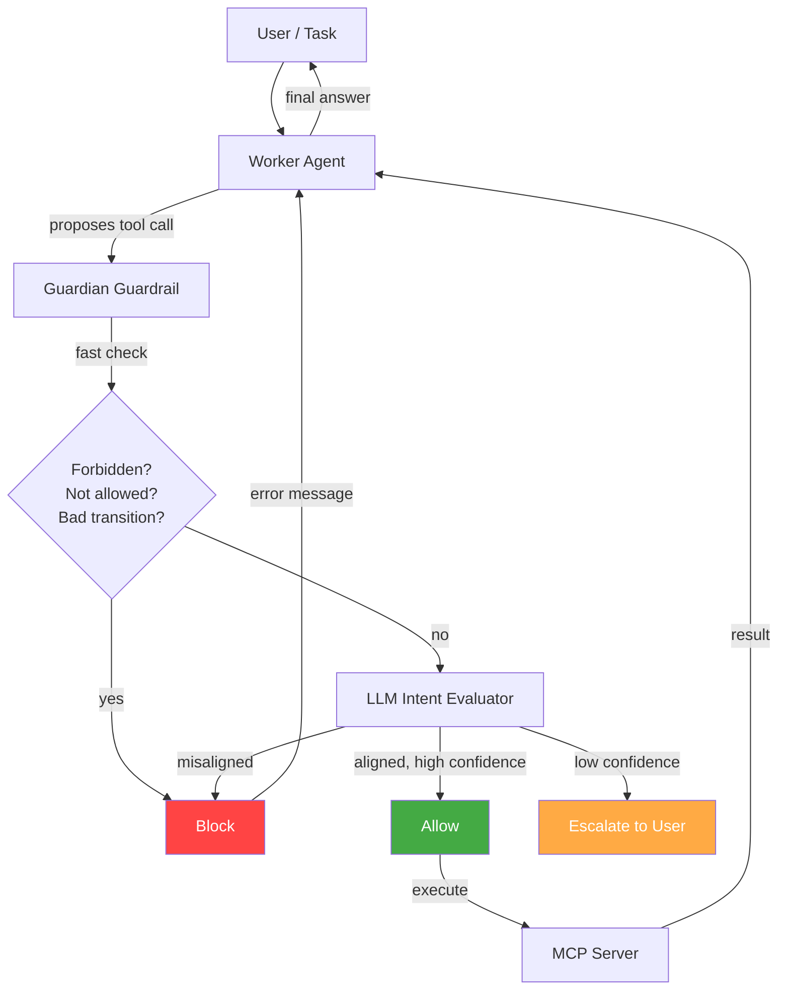

# MCP Guardian

**Intent enforcement for MCP tool calls — whitelist-based security for AI agents.**

MCP Guardian wraps untrusted worker agents with a supervisory layer that validates every tool call against declared intent policies *before execution*. If a tool call doesn't match the policy, it's blocked — the tool never runs.



## The Problem

MCP servers expose powerful tools — file systems, databases, shell access, APIs. When an AI agent has unrestricted access to these tools, three things can go wrong: **prompt injection** (a malicious document hijacks the agent into calling dangerous tools), **model misalignment** (the model makes a judgment error and writes a file or runs a command it shouldn't), and **scope creep** (the agent gradually uses tools outside its mandate). In all three cases, the damage is done before anyone notices — the tool call reaches the MCP server and executes.

## The Solution

MCP Guardian validates every tool call **before execution**. If it doesn't match the policy, the call is blocked and the MCP server never sees it. The guardian uses a three-tier pipeline:

1. **Fast deterministic check (0ms)** — forbidden tools, whitelist enforcement, transition graph validation. No LLM, no network call. Catches the majority of bad calls instantly.
2. **LLM intent evaluation (1-5s)** — for calls that pass the fast check, an LLM evaluator analyzes the tool name, arguments, and prior context against the policy's workflow description and constraints.
3. **Escalation** — when the LLM is uncertain (confidence below threshold), the call is flagged for human review.

Every evaluation is logged with verdict, confidence, timing, and reasoning — giving you a complete audit trail.

For a detailed explanation, see [How It Works](architecture/how-it-works.md).

## Quick Example

```python
from mcp_guardian import GuardianToolGuardrail, IntentPolicy

policy = IntentPolicy(
    name="read-only",
    description="Read files only — no writes, no shell",
    expected_workflow="Read and list files to answer user questions",
    allowed_tools=["read_file", "list_directory"],
    forbidden_tools=["write_file", "execute_command"],
)

guardrail = GuardianToolGuardrail(policy=policy)
tools = await guardrail.wrap_mcp_tools(mcp_servers)

agent = Agent(name="Worker", tools=tools)
```

That's it. Every tool call the agent proposes now passes through the guardian before execution.

## Features

- **Core library** — `IntentPolicy`, `GuardianToolGuardrail`, `GuardianAgentHooks`
- **Multi-server support** — connect N servers, wrap all tools, enforce per-server or global policies
- **Glob patterns** — `read_*`, `write_*`, `"*"` in allowed/forbidden tool lists for easy policy authoring
- **Auth passthrough** — bearer tokens and custom headers per server, with `${ENV_VAR}` expansion
- **Hand-written policies** — YAML or JSON, version-controlled alongside your config
- **Config file** — single `guardian.yaml` defines servers, policies, auth, and model settings
- **OpenAI Agents SDK native** — uses `ToolInputGuardrail` and `AgentHooksBase`, no monkey-patching
- **Schema sanitization** — handles real-world MCP server schemas that break OpenAI strict mode

## Next Steps

- [Installation](getting-started/installation.md) — pip install and setup
- [Quick Start](getting-started/quickstart.md) — run the demo in 5 minutes
- [Three Lines to Guard](getting-started/three-lines.md) — add the guardian to your existing agent
- [How It Works](architecture/how-it-works.md) — detailed explanation of the guardian
- [Architecture](architecture/overview.md) — components and data flow
